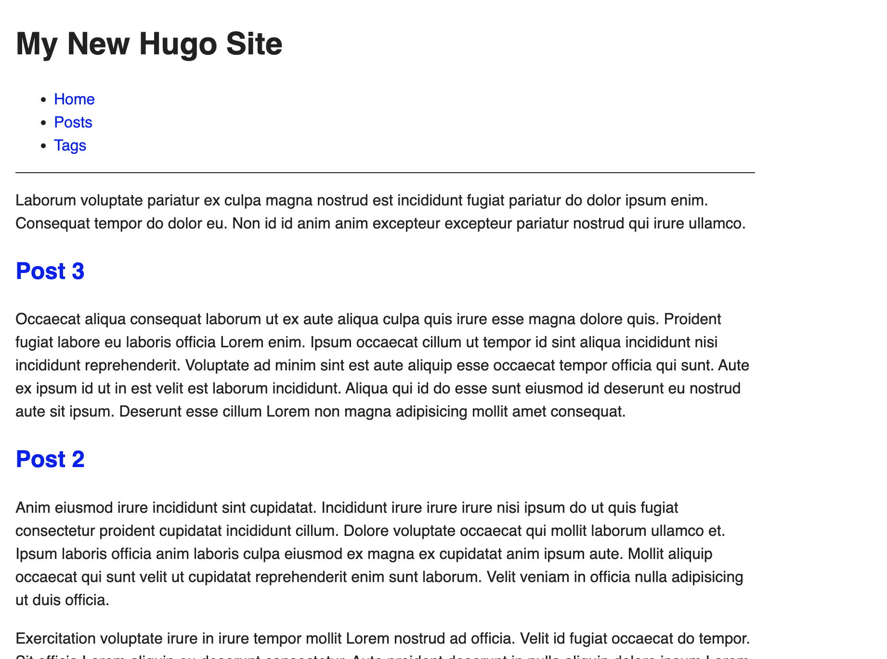
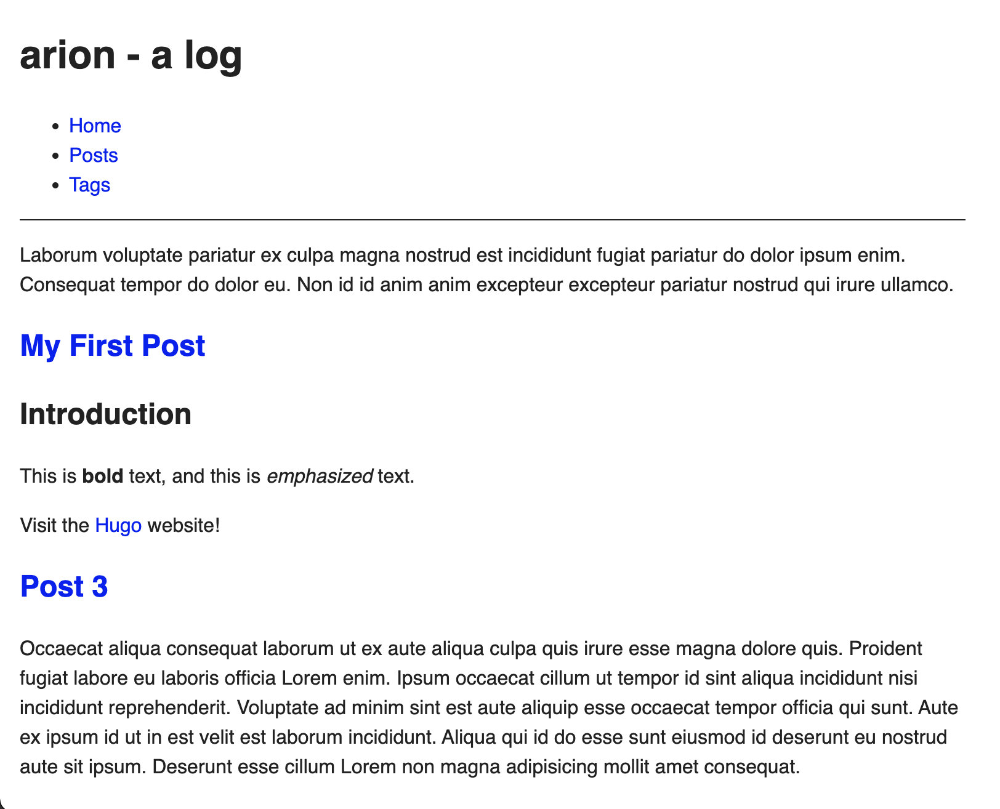

# alog 

## commands
hugo server (run development server)  
hugo server -D (run development server with drafts)  

**caution**  
hugo (publish see [deploy-your-site](https://gohugo.io/getting-started/usage/#deploy-your-site))  

## TODO
- confirm when deleting the contents of the public folder is necessary.  
 - it seems when a new tag is added 
- use a theme? or nah?
- menu logic is used within the theme hugo.toml
- how to add/remove tags

## frontmatter
[draft-future-and-expired-content](https://gohugo.io/getting-started/usage/#draft-future-and-expired-content)

### publishDate

adding `publishDate = 2025-02-22T15:00:22-05:00` which is, at this moment, in the future, will not show the post, when `draft = true` and running the dev server with `hugo server -D` because the publish date has not been reached. 

## hugo themes
Can import a theme or just create a new "skeleton".  

Themes have a `hugo.toml` file. Contains site menu logic.  
[theme-skeleton](https://gohugo.io/getting-started/directory-structure/#theme-skeleton)  
>Using the union file system described above, Hugo mounts each of these directories to the corresponding location in the project. When two files have the same path, the file in the project directory takes precedence. This allows you, for example, to override a theme’s template by placing a copy in the same location within the project directory.  

Adding to the themes/alog directories moves more of the site to the theme of the site. More long term if continuing to use the theme.  

So, since `/archetypes/` and `themes/alog/archetypes/` both contain the same default.md file, removing it from `/archetypes/` is fine since it is mounted from `themes/alog/archetypes/`.  

Also, this is the reason the lorem ipsum posts remain. Once I want these posts to no longer be mounted into the `/content` directory, I can delete theme from the `/themes/alog/content/` directory.

### alog
any notes on the alog theme  

## git branch stategy
If you "publish" a Hugo site by running the command `hugo`, commit your changes and push to main, the next person to pull from main will not be able to run in development mode with `hugo server --buildDrafts` or `hugo server -D`.

Current thought process is use a dev branch for "development mode". In this mode, you never publish with `hugo`. You PR to the `pub` branch acting as a production ready branch. When you want to release or deploy, you PR to the `main` branch, which uses the github actions to deploy the site.  


## hugo.toml
```
baseURL = 'https://example.org/'
languageCode = 'en-us'
title = 'Arion (you said it wrong)'
theme = 'ananke'
```

## themes
Went with 
The quick-start uses ananke.
https://github.com/theNewDynamic/gohugo-theme-ananke#readme
add the ananke theme by copying config in themes/ananke/exampleSite/config.toml to root config.toml

## hosting 
https://gohugo.io/hosting-and-deployment/hosting-on-github/
I changed the hugo version from 0.141.0 to 0.135.0 in the `.github/workflows/hugo.yaml` file

## doc
The [hugo docs getting started section](https://gohugo.io/getting-started/)  
The [hugo docs getting started quickstart section](https://gohugo.io/getting-started/quick-start/) I used to get started.

### site creation
```
mind@yours arionalmond % hugo new site alog
Congratulations! Your new Hugo site was created in /Users/arionalmond/github.com/arionalmond/alog/alog.

Just a few more steps...

1. Change the current directory to /Users/arionalmond/github.com/arionalmond/alog/alog.
2. Create or install a theme:
   - Create a new theme with the command "hugo new theme <THEMENAME>"
   - Or, install a theme from https://themes.gohugo.io/
3. Edit hugo.toml, setting the "theme" property to the theme name.
4. Create new content with the command "hugo new content <SECTIONNAME>/<FILENAME>.<FORMAT>".
5. Start the embedded web server with the command "hugo server --buildDrafts".

See documentation at https://gohugo.io/.
```

`cd alog`

```
mind@yours alog % hugo new theme alog     
Creating new theme in /Users/arionalmond/github.com/arionalmond/alog/themes/alog

mind@yours alog % echo "theme = 'alog'" >> hugo.toml
mind@yours alog % hugo server
Watching for changes in /Users/arionalmond/github.com/arionalmond/alog/{archetypes,assets,content,data,i18n,layouts,static,themes}
Watching for config changes in /Users/arionalmond/github.com/arionalmond/alog/hugo.toml, /Users/arionalmond/github.com/arionalmond/alog/themes/alog/hugo.toml
Start building sites … 
hugo v0.135.0+extended darwin/amd64 BuildDate=2024-09-27T13:17:08Z VendorInfo=brew


                   | EN  
-------------------+-----
  Pages            | 18  
  Paginator pages  |  0  
  Non-page files   |  1  
  Static files     |  1  
  Processed images |  0  
  Aliases          |  0  
  Cleaned          |  0  

Built in 58 ms
Environment: "development"
Serving pages from disk
Running in Fast Render Mode. For full rebuilds on change: hugo server --disableFastRender
Web Server is available at http://localhost:1313/ (bind address 127.0.0.1) 
Press Ctrl+C to stop

```



```
hugo new content content/posts/my-first-post.md
Content "/Users/arionalmond/github.com/arionalmond/alog/content/posts/my-first-post.md" created
mind@yours alog % hugo server --buildDrafts
Watching for changes in /Users/arionalmond/github.com/arionalmond/alog/{archetypes,assets,content,data,i18n,layouts,static,themes}
Watching for config changes in /Users/arionalmond/github.com/arionalmond/alog/hugo.toml, /Users/arionalmond/github.com/arionalmond/alog/themes/alog/hugo.toml
Start building sites … 
hugo v0.135.0+extended darwin/amd64 BuildDate=2024-09-27T13:17:08Z VendorInfo=brew


                   | EN  
-------------------+-----
  Pages            | 19  
  Paginator pages  |  0  
  Non-page files   |  1  
  Static files     |  1  
  Processed images |  0  
  Aliases          |  0  
  Cleaned          |  0  

Built in 39 ms
Environment: "development"
Serving pages from disk
Running in Fast Render Mode. For full rebuilds on change: hugo server --disableFastRender
Web Server is available at http://localhost:1313/ (bind address 127.0.0.1) 
Press Ctrl+C to stop
```


## notes
[Hugo in 100 Seconds](https://www.youtube.com/watch?v=0RKpf3rK57I)  
Files from the video are in `.100s/`  

Used as a CMS allowing author's to create content in markdown, then rendered to html based 
on the structure of the file system. File System Routing.

Developers use templates to control how the content is presented. Go Templates to 
interopolate and transform data from content.

example templates in .100s/laytouts/

templates can: 

define variables:
```
{{ $hello := value}}
```
form loops:
```
{{ range .Pages }}

{{ end }}
```
fetch:
```
{{ $myData := getJSON "url" }}
```

all kinds of other functionality (os.Stat, now, md5, Math)

Templates are organized into hierarchy of layouts
minimize code duplication, while maximizing flexibility

Content types with Taxonomy system
Easy to implement menus, tags, categories without plugins
used on Cloudflare documentation, smashing magazine and fireship.io

Get Started:
Install
`hugo new site my-blog`
Create a new web page by writing markdown in the content folder
OR use cli to generate it `hugo new end-the-fed.md` which provides a
default schema that can be customized in the arhcetypes folder.

Can install a theme or structure it from scrath using layouts (folder).

Syntax Highligting
Image Processing
Internationalization
Shortcodes